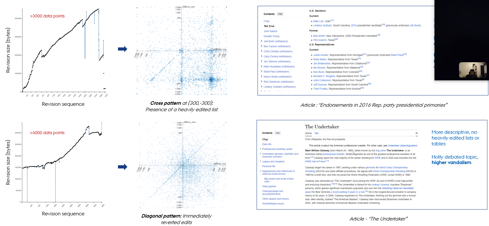
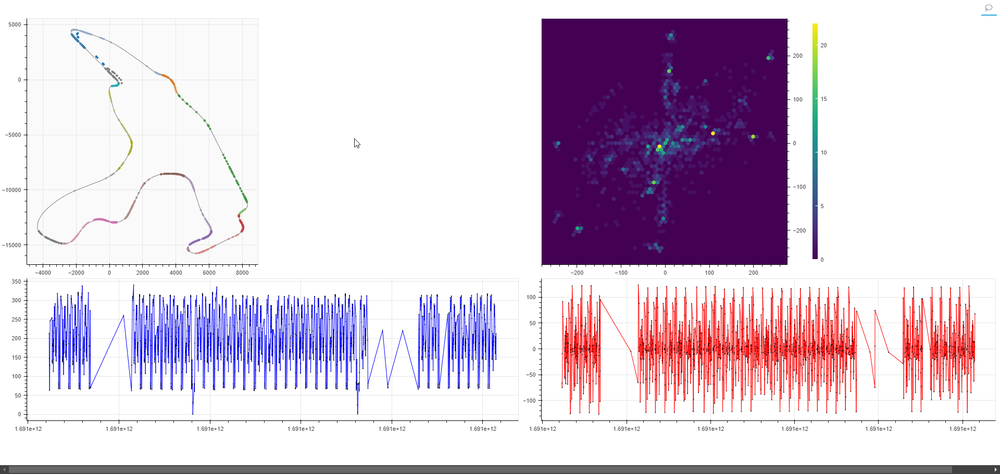

# LaNe Plot: A transformation for visualizing time-series data

Published at [EuroVis 2024](https://diglib.eg.org/items/3f080ebe-394a-4ea5-b1b2-ba60ff3db05f)

LaNe Plot is a scatterplot for visualizing time-series data. Each data point in the time-series is plotted based on the difference in value between its neighbors. This allows smaller patterns that are not visible on a line chart to be revealed and analyzed. See the figure below a design sketch. 

## Example dataset 1: Wikipedia revisions

We took a dataset of Wikipedia revisions and extracted a time series of the size of each edit. This time series was then visualized using LaNe Plot. See the figure below for an example:

To explore the wikipedia dataset, clone the repository and run the following commands:

### `npm install`
### `cd backend_temp/python`
### `pip install -r requirements.txt`
### `cd ../../`
### `npm run dev`

Runs the app in the development mode.\
Open [http://localhost:5173/](http://localhost:5173/) to view it in the browser.

The page will reload if you make edits.\
You will also see any lint errors in the console.

## Example dataset 2: Formula 1 telemetry data

We took a dataset of Formula 1 telemetry data and extracted a time series of the speed of the car. This time series was then visualized using LaNe Plot. See the figure below for an example:

To explore the formula 1 dataset, it is **recommended that you use Visual Studio Code**. Clone the repository and run the following commands:

### `cd backend_temp/python`
### `pip install -r requirements.txt`
### `cd data_processing`

1. Open `formula_1_bokeh.py`.
2. Click on the drop down menu next to the "Run" button (top-right corner). 
3. Select `Python Debugger: Debug using launch.json`.

The visualization should open on your default browser. **First time loading takes a few minutes**, as the formula 1 dataset is being fetched from the web and cached. Later runs will be faster.

Written in TypeScript and Python. Built with React, Flask, and D3.js.

## License : CC BY 4.0 DEED
This license enables reusers to distribute, remix, adapt, and build upon the material in any medium or format, so long as attribution is given to the creator. The license allows for commercial use. Refer https://creativecommons.org/licenses/by/4.0/
